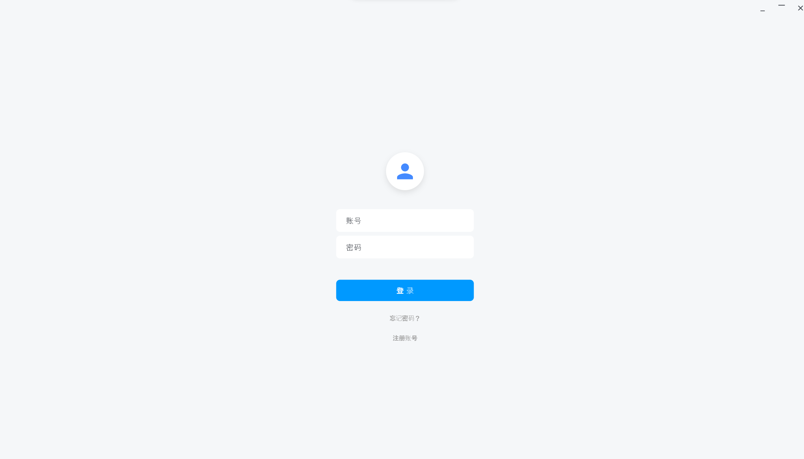

# 会议系统 (MeetingProject)

基于 **Flutter + WebRTC** 的跨平台视频会议系统，支持桌面端（Windows / macOS / Linux）、移动端（Android / iOS）以及 Web 端，提供低延迟的实时音视频通话、屏幕共享、文字聊天等功能。

## 相关仓库

- 信令服务端：https://github.com/DongGuZhengHuaJi/SignalingServer
- API服务端：https://github.com/DongGuZhengHuaJi/APIServer

---

## 目录

- [功能特性](#功能特性)
- [技术栈](#技术栈)
- [运行环境](#运行环境)
- [项目结构](#项目结构)
- [快速开始](#快速开始)
- [后端服务配置](#后端服务配置)
- [应用截图](#应用截图)
- [核心模块](#核心模块)
- [构建与发布](#构建与发布)
- [常见问题](#常见问题)
- [License](#license)

---

## 功能特性

### 账号体系
- ✅ 账号密码登录
- ✅ 用户注册
- ✅ 忘记密码（找回）
- ✅ 用户昵称编辑（个人头像浮层）

### 会议功能
- 🚀 **快速会议**：一键创建会议并立即加入
- 🔗 **加入会议**：输入会议号加入已有房间
- 📅 **预定会议**：自定义时间发起预约，系统自动生成会议号
- 🖥️ **共享屏幕**：一键发起屏幕共享会话
- 🎙️ **麦克风控制**：开关 + 设备选择 + 系统麦克风可用性探测
- 📷 **摄像头控制**：开关 + 多设备切换
- 💬 **会议聊天**：右侧抽屉式聊天面板，自动适配窗口尺寸
- 👥 **参会者列表**：实时显示所有参会者及其音视频状态

### 布局模式
- **网格模式（Grid）**：1 人占满 / 2 人左右分屏 / 3+ 人 16:9 网格
- **演讲者模式（Speaker）**：主画面 + 缩略图侧栏，可手动切换主画面

### 窗口与界面
- 自定义无边框窗口（隐藏系统标题栏，可拖拽、双击最大化）
- 登录窗口 400×600，主窗口 1200×800，自动居中
- 桌面端窗口大小可调（聊天面板打开时自动扩宽）
- 任务栏图标可见

### 会议状态
- 30 秒周期刷新预约/历史会议状态
- 状态徽章：未开始 / 已开始（可点击加入）/ 已关闭

---

## 技术栈

| 类别 | 技术 | 说明 |
|------|------|------|
| 跨端框架 | Flutter (SDK ^3.11.4) | 一套代码覆盖 6 端 |
| 实时通信 | `flutter_webrtc ^0.9.0` | 浏览器原生 WebRTC 协议的 Flutter 实现 |
| 信令通道 | `web_socket ^1.0.1` | WebSocket 长连接用于 SDP / ICE 协商 |
| 状态管理 | `provider ^6.0.5` + `change_notifier` | 响应式状态管理 |
| 窗口管理 | `window_manager ^0.5.1` | 桌面端窗口控制（拖动 / 缩放 / 最大化） |
| 网络请求 | 自研 `http_mgr` | HTTP 登录/注册/会议接口 |
| 国际化 | `intl ^0.18.0` | 时间/日期格式化 |
| 日志 | `logger ^2.7.0` | 结构化日志输出 |
| UI 规范 | Material 3 | 主题色 `#1677FF`（蓝） |

> Dart 占比 80.3%，其余主要为 C++ / CMake（WebRTC 平台通道与原生插件）。

---

## 运行环境

| 项 | 要求 |
|----|------|
| Flutter SDK | >= 3.11.4 |
| Dart SDK | 随 Flutter |
| 操作系统 | Windows 10+ / macOS 12+ / Ubuntu 20.04+ / Android 6+ / iOS 13+ / 现代浏览器 |
| 显卡 | 桌面端需可用的摄像头/麦克风访问权限 |
| 后端 | API 服务（端口 8888）+ WebSocket 信令服务（端口 8080） |

---

## 项目结构

```
MeetingProject/
├── lib/                          # Flutter 源码
│   ├── main.dart                 # 入口，初始化窗口 → LoginPage
│   ├── app_env.dart              # API / 信令地址（编译期注入）
│   ├── http_mgr.dart             # HTTP 客户端（登录/注册/会议接口）
│   ├── websocket_mgr.dart        # WebSocket 客户端
│   ├── webrtc_mgr.dart           # WebRTC 核心封装（PeerConnection / 信令交互）
│   ├── peer_models.dart          # Peer / Stream 数据模型
│   ├── home_controller.dart      # 首页状态控制器
│   ├── home_page.dart            # 首页（快速会议/加入/预定/共享）
│   ├── meeting_controller.dart   # 会议页业务逻辑
│   ├── meeting_page.dart         # 会议页（视频网格 / 演讲者模式 / 聊天）
│   ├── login_page.dart           # 登录页
│   ├── register_page.dart        # 注册页
│   └── forget_pwd_page.dart      # 忘记密码页
├── android/  ios/  web/  windows/  macos/  linux/   # 各平台原生工程
├── pubspec.yaml                  # 依赖与版本配置
└── README.md
```

---

## 快速开始

### 1. 克隆仓库

```bash
git clone https://github.com/vito67291-bot/MeetingProject.git
cd MeetingProject
```

### 2. 安装依赖

```bash
flutter pub get
```

### 3. 配置后端地址（可选）

默认指向 `127.0.0.1`，本地起后端可直接运行。如需指向远程服务器：

```bash
# Linux / macOS
flutter run \
  --dart-define=API_BASE_URL=http://your-api-host:8888 \
  --dart-define=SIGNALING_URL=ws://your-signaling-host:8080

# Windows (PowerShell)
flutter run `
  --dart-define=API_BASE_URL=http://your-api-host:8888 `
  --dart-define=SIGNALING_URL=ws://your-signaling-host:8080
```

### 4. 运行

```bash
# 桌面端（推荐先在桌面体验完整功能）
flutter run -d windows
flutter run -d macos
flutter run -d linux

# 移动端
flutter run -d android
flutter run -d ios

# Web
flutter run -d chrome
```

### 5. 登录体验

启动后弹出 400×600 的登录窗口，输入账号密码即可进入主界面。
登录成功后窗口自动调整至 1200×800。

---

## 后端服务配置

本客户端依赖两个后端服务，地址通过编译期 `--dart-define` 注入：

| 服务 | 默认地址 | 用途 |
|------|----------|------|
| REST API | `http://127.0.0.1:8888` | 登录、注册、会议预约/历史/状态 |
| WebSocket Signaling | `ws://127.0.0.1:8080` | WebRTC SDP / ICE 候选中转 |

对应常量定义在 `lib/app_env.dart`：

```dart
const String kApiBaseUrl   = String.fromEnvironment('API_BASE_URL',   defaultValue: 'http://127.0.0.1:8888');
const String kSignalingUrl = String.fromEnvironment('SIGNALING_URL',  defaultValue: 'ws://127.0.0.1:8080');
```

> 仓库中保留了远程测试服务器 `114.132.52.242` 的注释样例，可按需切换。

---

## 应用截图

> 以下为应用运行截图，图片存放在 `picture/` 目录。

### 登录页
<!-- SCREENSHOT: login -->


### 首页
<!-- SCREENSHOT: home -->


- 左侧：用户头像 + 功能导航（会议、消息、设置、个人）
- 右上：4 个功能卡片（快速会议、加入会议、预定会议、共享屏幕）
- 右下：预约会议列表 + 历史会议列表

### 会议页 — 网格模式
<!-- SCREENSHOT: meeting-grid -->


### 会议页 — 演讲者模式
<!-- SCREENSHOT: meeting-speaker -->


### 会议页 — 聊天面板
<!-- SCREENSHOT: meeting-chat -->


### 屏幕共享
<!-- SCREENSHOT: screen-share -->


---

## 核心模块

### 1. WebRTC 管理（`webrtc_mgr.dart`）
封装 `RTCPeerConnection` 的完整生命周期：
- 创建 / 关闭 PeerConnection
- 协商媒体（offer / answer）
- ICE 候选收集与交换（经由 `websocket_mgr`）
- 远端流订阅

### 2. 信令通道（`websocket_mgr.dart`）
基于 `WebSocket` 的长连接，负责：
- SDP 中转
- ICE 候选转发
- 用户加入 / 离开房间广播
- 会议状态推送

### 3. 会议控制器（`meeting_controller.dart`）
业务逻辑层，与 UI 解耦：
- 媒体设备管理（摄像头 / 麦克风 / 屏幕）
- 参会者状态追踪
- 聊天消息收发
- 离开 / 结束会议流程

### 4. 首页控制器（`home_controller.dart`）
- 30 秒周期轮询会议状态
- 预约 / 快速 / 加入 / 共享 四种入口的封装
- 昵称修改与用户信息维护

### 5. HTTP 管理（`http_mgr.dart`）
统一封装登录、注册、忘记密码、预约列表、历史列表等 REST 接口，错误通过 `ApiException` 抛出。

---

## 构建与发布

```bash
# Android APK
flutter build apk --release \
  --dart-define=API_BASE_URL=https://api.example.com \
  --dart-define=SIGNALING_URL=wss://signaling.example.com

# Android AppBundle
flutter build appbundle --release

# iOS
flutter build ipa --release

# Windows 安装包
flutter build windows --release

# macOS
flutter build macos --release

# Linux
flutter build linux --release

# Web
flutter build web --release
```

> **Web 端注意**：WebRTC 在 Web 平台使用浏览器原生实现，需确保部署到 HTTPS（或 localhost），且信令地址使用 `wss://`。

---

## 常见问题

<details>
<summary><b>Q1: 桌面端启动后窗口很小？</b></summary>

这是登录页的默认行为（400×600）。登录成功后窗口会自动调整到 1200×800。如需修改默认值，可编辑 `lib/main.dart` 中 `WindowOptions` 的 `size` 字段。

</details>

<details>
<summary><b>Q2: Web 端摄像头/麦克风无法使用？</b></summary>

浏览器要求安全上下文（HTTPS 或 localhost）。`flutter_webrtc` 在 Web 上会使用浏览器原生 `getUserMedia`，需要在站点设置中授予权限。

</details>

<details>
<summary><b>Q3: 切换后端地址后没生效？</b></summary>

`app_env.dart` 使用 `String.fromEnvironment`，该值在 **编译期** 注入。请确认：
1. 使用了 `--dart-define=API_BASE_URL=...` / `--dart-define=SIGNALING_URL=...`
2. 完整 `flutter clean && flutter pub get && flutter run` 一次

</details>

<details>
<summary><b>Q4: iOS 编译报错？</b></summary>

WebRTC 在 iOS 上需要 `NSMicrophoneUsageDescription` 与 `NSCameraUsageDescription`，参考 `ios/Runner/Info.plist` 配置权限文案。

</details>

---

## 开发路线（Roadmap）

- [ ] 会议录制（本地 + 服务端）
- [ ] 虚拟背景 / 美颜
- [ ] 会议邀请链接分享
- [ ] 多语言支持（i18n）
- [ ] 端到端加密（E2EE）
- [ ] 服务端 P2P / SFU 切换

---

## 贡献

欢迎 PR 与 Issue！提交前请：

1. `flutter analyze` 通过
2. `flutter test` 通过
3. 遵循 `analysis_options.yaml` 内的 Lint 规则

---

## License

MIT License. 详见 `LICENSE` 文件。

---

> 💡 提示：截图统一放在 `picture/` 目录，按本 README 中的相对路径引用，便于长期维护。
